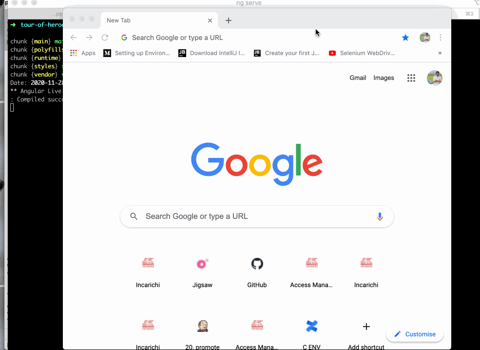
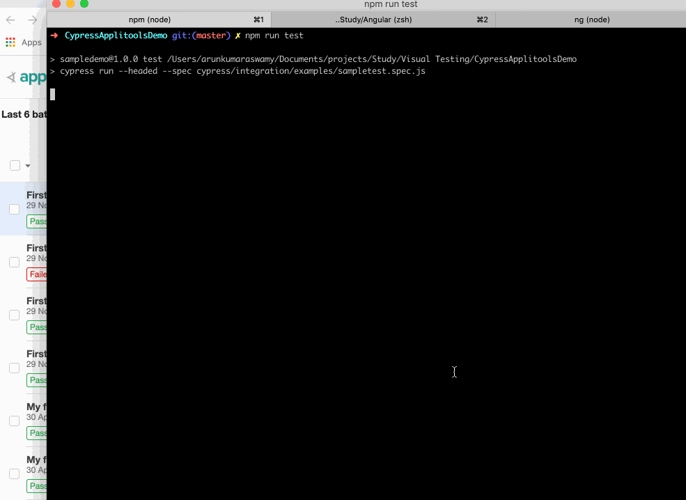

# Visual Testing with Applitools

In my [previous blog](https://arunk2493.github.io/VisualTesting/) I have shared my learning of Visual Testing and its techniques. Now we can see how **_Applitools_** is used to do the Visual Testing.

## Applitools - An Intro

- Applitools is one the powerful visual testing tools in the market in recent days.
- Applitools has its own SDKs to analyze entire page, elements or iframes
- It can be easily integrated with the existing projects
- Applitools comes with Pricing and Free version and the features also depends upon the pricing
- There are 3 main components of Applitools;
  1. Applitools Eyes
  2. UltraFast Grid
  3. Seamless Integration
 
## Applitools Eyes: Captures and analyzes the entire screen of the application.
## UltraFast Grid: It provides a powerful cross browser testing. It provides the feature to run massive parallel tests across all browsers, devices and viewports
## Seamless Integration: It can be easily integrated with the existing code and works with modern test frameworks, CI/CD and more.

Applitools provides support to all the test frameworks and languages such as Selenium Java, Cypress, JavaScript,React and also Appium, Espresso,XCUI, etc,.

OK!!! Let's Jump into some visual Demo and some code.

### How to setup Applitools Account?
   - We can easily sign up with out Google or GitHub Account.
   - Once after the account is setup we will get an API KEY for the Applitools Dashboard. This API KEY is responsible for running our tests on the Applitools
   
### How to setup Applitools in our Project?

   1. First Set the Applitools API KEY in our environment variable or else we can create `applitools.config.js` file in our project and add the API KEY.
   _Example: In MAC we can set as vi ~/.bash_profile and enter export APPLITOOLS_API_KEY=THE API KEY VALUE_
   2. After setting the API KEY then we need to install the Applitools eyes dependency. Here in this demo we are going to use **Cypress** and a node project so we need to install the dependency using `npm install @applitools/eyes-cypress` command. This command install all the dependencies needed for the **EYES** SDK.
   3. Now we need to run the command `npx eyes-setup`. This command will setup the required plugins and command needed for the **EYES** SDK.
   4. Then we need to add the eyesOpen, eyesCheckWindow, etc., methods in our test to enable the visual testing in our project
   
### Demo - Setup a Cypress project and integrate with Applitools

  1. Create an empty repository in Git and clone that repo in your local in the required directory and navigate into the project.
  2. Now initialise the node project using `npm init` command and enter the project name and click enter and type Yes in the final step
  3. Next install Cypress using `npm install cypress`. This will install all the dependencies and the folder structure for Cypress.
  4. Now go to `/cypress/integration/examples/` which is the test folder for Cypress and all the tests should be present under this folder and create a test file.       _For Example:`/cypress/integration/examples/SampleTest.spec.js`_
  5. Now run the particular test using `npx cypress run --spec cypress/integration/examples/SampleTest.spec.js` or add `cypress run --spec                 cypress/integration/examples/SampleTest.spec.js` line to test value under scripts in the `package.json` file
  6. To run in headless mode use `cypress run --headed --spec cypress/integration/examples/SampleTest.spec.js`
  
### Cypress Demo

  
  
YAY!!!! Now we have created a simple test with cypress. Next we will see how can we integrate Applitools to our Cypress Project. For running the Applitools I have taken the demo tutorial from the Angular site.

### Angular App

  
  
  _Here I haven't deployed the app so it will run in localhost._
  
### Example Scenario

### Code Setup

    
  
  Let's consider a scenario, Initially I have created the details and the heros name element has rounded border in the left side and assume it has been deployed in  production. Now we will run the test in applitools and create a base line image which will be used for the visual test.
   
  Now due to some UI refactoring the rounded border has been changed i.e, We have changed the border radius in CSS file. Now I run the test against the baseline image and see whether any changes in the UI affected the application.
  
  Yes!! it has affected the UI and we are failing the test.
  
  Next we have added some title change and also altered the border radius and again running the test against the BaseLine image. Now the UI appears to be convincing and we are accepting the test case.
  
    
  
  Finally We are running the test cases one more time and checking any pixel changes has been happened by selecting the Preview match level as **Strict** and the tests seems to Passed.
  
    
  
  Now we can also run our test across multiple browsers and devices and different view ports. To do this we need to create a `applitools.config.js` file in our project root folder and add the browser configurations as show below and run the tests. We can also name the tests under a badge as shown below.
  
   
  
  If we have licensed version we can able to compare and merge the accepted changes to the code base and integrate with CI and run the tests effectively. And also of any tests are failed we can able to mark as a bug too.
  
  Since have a free account only we can able to see the changes and Accept / Reject the changes.
  
### Pros
  
  - Effective Dashboard
  - Easy to integrate with existing projects
  - Fast and reliable execution

### Cons

  - Pricing for most of the features
  - For free users only 100 builds/month
  - Only 1 concurrent users so the test execution may get slower during the parallel execution.
  
Finally!! This is how we can perform visual testing with Applitools and see the changes happening in the UI.

References: [Applitools](https://applitools.com/)

Basic Code: [Demo Code - Basic](https://github.com/arunk2493/CypressApplitoolsDemo)

The above content is purely based on my learnings, if anything is missed please correct me always open to feedbacks!!

### Learn..Educate..and Shine!!
